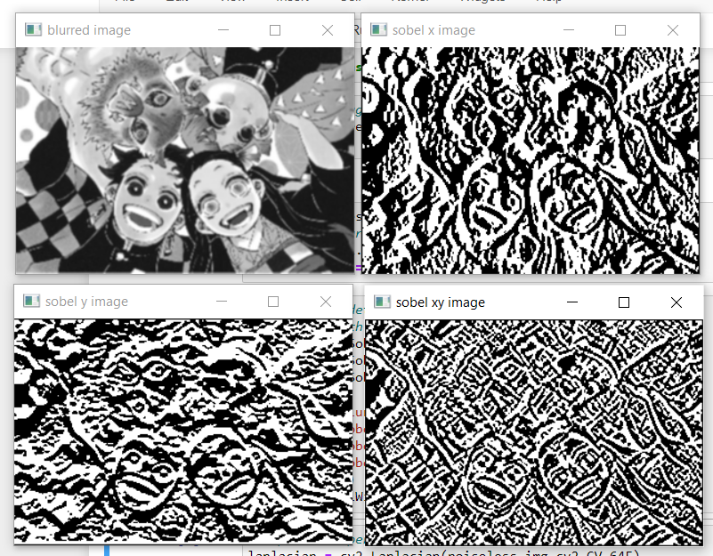
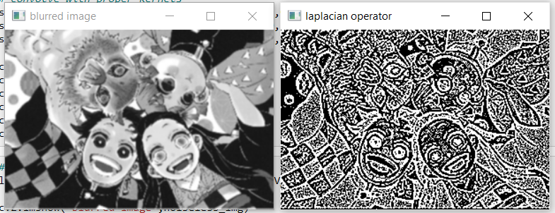
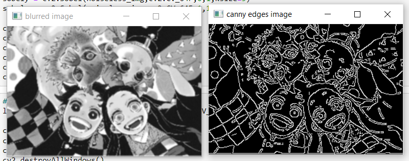

# Edge-Detection
## Aim:
To perform edge detection using Sobel, Laplacian, and Canny edge detectors.

## Software Required:
Anaconda - Python 3.7

## Algorithm:
### Step1:
Import the necessary modules.
<br>

### Step2:
Convert image into GRAY using COLOR_BGR2GRAY
<br>

### Step3:
Apply Gaussian Blur to the gray image
<br>

### Step4:
Perform edge detection on a image.

Sobel
Laplacian
Canny
<br>

### Step5:
Display the original images with edge detected images.
<br>

 
## Program:
```python
# experiment by: Kaushika A
# reg no : 212221230048
```

### Import the packages
``` Python
# Import the necessary packages
import cv2
import numpy as np
```
### Load the image, Convert to grayscale and remove noise
```python
# load the image
in_img=cv2.imread('picture.PNG')
in_img= cv2.resize(in_img, (304,204))
# convert to gray scale
gray_img = cv2.cvtColor(in_img,cv2.COLOR_BGR2GRAY)
noiseless_img = cv2.GaussianBlur(gray_img,(3,3),0)
```

### SOBEL EDGE DETECTOR
```python
# Sobel edge detector
# convolve with proper kernels
sobelx = cv2.Sobel(noiseless_img,cv2.CV_64F,1,0,ksize=5)
sobely = cv2.Sobel(noiseless_img,cv2.CV_64F,0,1,ksize=5)
sobelxy =cv2.Sobel(noiseless_img,cv2.CV_64F,1,1,ksize=5)

cv2.imshow('blurred image',noiseless_img)
cv2.imshow('sobel x image',sobelx)
cv2.imshow('sobel y image',sobely)
cv2.imshow('sobel xy image',sobelxy)
cv2.waitKey(0)
cv2.destroyAllWindows()
```
### LAPLACIAN EDGE DETECTOR
```python
# Laplacian operator
laplacian = cv2.Laplacian(noiseless_img,cv2.CV_64F)

cv2.imshow('blurred image',noiseless_img)
cv2.imshow('laplacian operator',laplacian)
cv2.waitKey(0)
cv2.destroyAllWindows()
```
### CANNY EDGE DETECTOR
```python
# Canny Edge detector
canny = cv2.Canny(noiseless_img, 120, 150)

cv2.imshow('blurred image',noiseless_img)
cv2.imshow('canny edges image',canny)
cv2.waitKey(0)
cv2.destroyAllWindows()
```
## Output:
### SOBEL EDGE DETECTOR

<br>


### LAPLACIAN EDGE DETECTOR

<br>


### CANNY EDGE DETECTOR

<br>

## Result:
Thus the edges are detected using Sobel, Laplacian, and Canny edge detectors.
